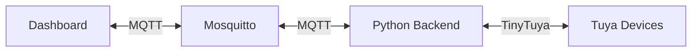

[](https://opensource.org/licenses/MIT)
# Pi-IOT Smart Home Control System

A modular smart home control system designed to manage Tuya-compatible devices using a Raspberry Pi with a connected touchscreen. The system combines Python-based device control, an MQTT message broker, and a modern React dashboard to provide a responsive, extensible home automation platform.


 


## Project Objective

The objective of Pi-IOT is to build a fully local, customizable smart home control system that runs on a Raspberry Pi and serves as a dedicated smart home control panel. The system provides:

- A responsive touchscreen dashboard
- Real-time device control and telemetry
- MQTT-based messaging architecture
- Modular backend Python scripts
- Support for lights and smart plugs
- Easy scalability for additional devices

The long-term goal is to create a self-contained smart home environment that prioritises reliability, local control, and extensibility while remaining simple to maintain and expand.

---

## 🏗️ Project Architecture

```
Pi-IOT/
├── smartDevices/              # Backend Python scripts
│   ├── CLI_Version/           # Interactive CLI control scripts
│   │   ├── light_CLI.py       # Light control CLI
│   │   ├── plug_CLI.py        # Plug control CLI
│   │   └── devices.json       # Device configuration (not included)
│   ├── utils/                 # Shared utility modules
│   │   ├── lightHelpers.py
│   │   ├── plugHelpers.py
│   │   ├── converters.py
│   │   ├── hsv.py
│   │   └── mqtt_helpers.py
│   ├── light_loop.py          # Light telemetry loop
│   └── plug_loop.py           # Plug telemetry loop
├── simple-dashboard/          # React web dashboard
│   ├── components/
│   ├── config.js
│   ├── device-mqtt.js
│   └── mqtt-handler.js
└── mosquitto.conf             # MQTT broker configuration
```

---

## 🔧 How It Works

### Communication Flow



---
### MQTT Topic Structure

**Light (light1)**
- `pi/light1/set`
- `pi/light1/state`
- `pi/light1/mode`
- `pi/light1/brightness`
- `pi/light1/color`
- `pi/light1/color_temp`

**Plug (plug1)**
- `pi/plug1/set`
- `pi/plug1/state`
- `pi/plug1/power`
- `pi/plug1/voltage`
- `pi/plug1/current`

*Topic structure remains consistent. Only device identifiers change (e.g., light2, plug3).*

---

## 🚀 Setup

### Prerequisites

### Prerequisites
* Python 3.8+ (tested on 3.10)
* Node.js 16+ (tested on 18.x)
* Mosquitto MQTT Broker 2.0+
* Anaconda/Miniconda (recommended)

### Installation

**1. Clone Repository**
```bash
git clone <repository-url>
cd Pi-IOT
```

**2. Python Environment**
```bash
conda create -n pi-iot python=3.10
conda activate pi-iot
pip install tinytuya paho-mqtt
```

**3. Web Dashboard**
```bash
cd simple-dashboard
npm install
```

**4. Configure Devices**
- Create: `smartDevices/CLI_Version/devices.json`
- Add your TinyTuya device credentials.

---

## 📱 Usage

### Start MQTT Broker
```bash
mosquitto -c mosquitto.conf
```

### Web Dashboard
```bash
cd simple-dashboard
npm run dev
```
Open: `http://localhost:xxxx`

### CLI Control
- **Light**: `python light_CLI.py`
- **Plug**: `python plug_CLI.py`

## ➕ Adding New Devices

1. Run TinyTuya wizard:
   ```bash
   python -m tinytuya wizard
   ```
2. Add credentials to `devices.json`.
3. Duplicate appropriate CLI script.
4. Update:
   - Device index
   - MQTT topic identifiers
5. Update `simple-dashboard/config.js`.
6. Test in live mode.

---

## Key Features

- Real-time dashboard control
- Interactive CLI contrl
- Continuous telemetry publishing
- Multi-device support
- RGB color control
- Brightness and temperature control
- Smart plug energy monitoring
- Modular, reusable backend architecture

---

## 📄 License

This project is licensed under the MIT License.

## ⚠️ Development Disclaimer

All Python backend code within this project - including CLI scripts, device communication logic, MQTT handling, and utility modules - was developed by me through online tutorials, independent research into TinyTuya, MQTT communication patterns, and device protocol behaviour.

The JavaScript/React-based `simple-dashboard` frontend was developed with assistance from AI tools and online tutorials, as I currently have no prior experience with JavaScript or React. This assistance was used to accelerate UI structure and MQTT dashboard implementation while I focus primarily on backend architecture and device control logic.

This project serves both as a functional smart home system and as a personal learning platform for expanding frontend development skills.
