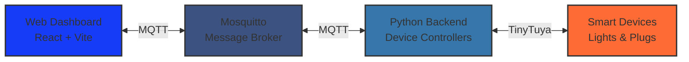

<div align="center">

# 🏠 Pi-IOT Smart Home Control System

[](https://opensource.org/licenses/MIT)
[](https://github.com/NicGroenewald/PI-IOT/releases)

**A local-first smart home dashboard for Raspberry Pi**

Control Tuya-compatible devices through an elegant web interface with real-time updates via MQTT

[Features](#-key-features) • [Architecture](#️-architecture) • [MQTT Topics](#-mqtt-topics) • [Screenshots](#-screenshots)

</div>

---

## 🎯 What is Pi-IOT?

Pi-IOT transforms your Raspberry Pi into a dedicated smart home control panel. It combines a React-based touchscreen dashboard with Python backend scripts to give you complete local control over your Tuya smart devices - no cloud required.

**Perfect for:**
- Local network control without internet dependency
- Custom automation workflows
- Privacy-focused home automation
- Learning IoT and MQTT architecture

<br>

## ✨ Key Features

<table>
<tr>
<td width="50%">

### 🎨 Dashboard
- Real-time device status
- RGB color picker
- Brightness & temperature control
- Power monitoring for plugs

</td>
<td width="50%">

### ⚙️ Backend
- MQTT message broker
- Python device controllers
- CLI and daemon modes
- Modular, extensible architecture

</td>
</tr>
</table>

<br>

## 📸 Screenshots

<div align="center">

### Dashboard Interface


### Responsive Layout


</div>

<br>

## 🏗️ Architecture



### Project Structure

```
Pi-IOT/
├── 📱 simple-dashboard/       # React web interface
│   ├── components/            # UI components
│   ├── config.js              # Device configuration
│   └── mqtt-handler.js        # MQTT communication
│
├── 🐍 smartDevices/           # Python backend
│   ├── CLI_Version/           # Interactive CLI tools
│   ├── utils/                 # Shared libraries
│   ├── light_loop.py          # Light telemetry daemon
│   └── plug_loop.py           # Plug telemetry daemon
│
└── ⚙️ mosquitto.conf          # MQTT broker config
```

## 🔌 MQTT Topics

**Light Control**
```
pi/light1/set          # Send commands
pi/light1/state        # Device on/off status
pi/light1/brightness   # Brightness level (0-100)
pi/light1/color        # RGB color (HSV format)
pi/light1/color_temp   # Color temperature
```

**Smart Plug**
```
pi/plug1/set           # Send commands
pi/plug1/state         # Device on/off status
pi/plug1/power         # Power consumption (W)
pi/plug1/voltage       # Voltage (V)
pi/plug1/current       # Current (mA)
```

> Topic structure stays consistent - just change the device ID (light2, plug3, etc.)

## 📄 License

This project is licensed under the **MIT License** - see the [LICENSE](LICENSE) file for details.

<br>

## ⚠️ Development Notes

**Backend (Python):** Independently developed through online tutorials, research into TinyTuya, MQTT protocols, and device communication patterns.

**Frontend (React):** Built with AI assistance and online tutorials as a learning exercise in modern web development.

This project serves dual purposes:
1. A functional local smart home system
2. A hands-on learning platform for IoT and web technologies

<br>

<div align="center">

---

[Report Bug](https://github.com/NicGroenewald/PI-IOT/issues) • [Request Feature](https://github.com/NicGroenewald/PI-IOT/issues) • [Star this repo ⭐](https://github.com/NicGroenewald/PI-IOT)

</div>
