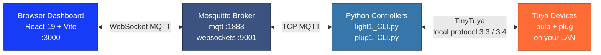
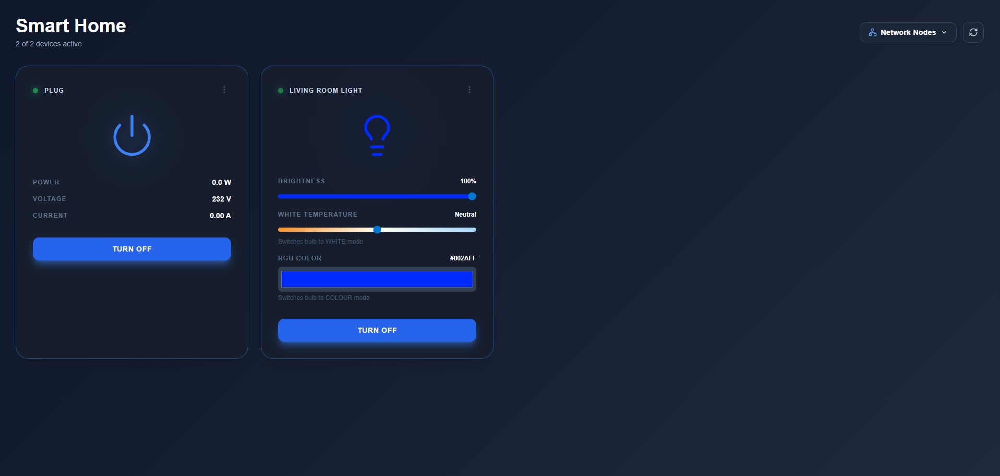
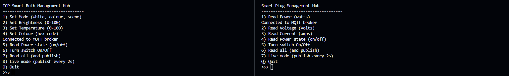

<div align="center">

# Pi-IOT — Local Smart Home Control

[](https://opensource.org/licenses/MIT)
[](https://github.com/NicGroenewald/PI-IOT/releases/latest)
[](https://www.python.org/)
[](https://react.dev/)

**Control Tuya smart devices on your own network — no vendor cloud, no account, no internet round-trip.**

[Why](#why) · [How it works](#how-it-works) · [Prerequisites](#prerequisites) · [Setup](#setup) · [Running it](#running-it) · [Using your own devices](#using-your-own-devices) · [MQTT reference](#mqtt-reference) · [Limitations](#limitations)

</div>

---

## Why

Off-the-shelf Tuya devices (sold under dozens of brands — TCP Smart, Smart Life, Tuya Smart, and others) work like this out of the box:

```
Your phone → internet → Tuya's cloud (China/EU region) → internet → your bulb, 2 metres away
```

Every switch press leaves your house and comes back. If your broadband drops, the vendor app stops working. If the vendor discontinues the product line, the hardware stops working. And every command is logged by a third party.

Tuya devices also speak a **local LAN protocol**, encrypted with a per-device "local key". If you extract that key once, you can talk to the device directly over your own network and never touch the cloud again:

```
Browser → MQTT (localhost) → Python controller → LAN → your bulb
```

That's what Pi-IOT does. It's a small, readable, end-to-end IoT stack — a React dashboard, a Mosquitto broker, and Python device controllers built on [TinyTuya](https://github.com/jasonacox/tinytuya) — running entirely on one machine, typically a Raspberry Pi driving a wall-mounted touchscreen.

It was built as a learning project, so the code is deliberately plain: no framework magic, no abstraction layers to decode. If you want to see how MQTT topics, device telemetry, and a reactive UI fit together, the whole system is about 2,000 lines of readable source.

---

## How it works


```mermaid
graph LR
    A["Browser Dashboard<br/>React 19 + Vite<br/>:3000"]
    B["Mosquitto Broker<br/>mqtt :1883<br/>websockets :9001"]
    C["Python Controllers<br/>light1_CLI.py<br/>plug1_CLI.py"]
    D["Tuya Devices<br/>bulb + plug<br/>on your LAN"]

    A <-->|"WebSocket MQTT"| B
    B <-->|"TCP MQTT"| C
    C <-->|"TinyTuya<br/>local protocol 3.3 / 3.4"| D

    style A fill:#163cf7,stroke:#0b1d7a,color:#fff
    style B fill:#3c5280,stroke:#22304d,color:#fff
    style C fill:#3776ab,stroke:#1f4460,color:#fff
    style D fill:#ff6b35,stroke:#a8401b,color:#fff
```

Three processes, one message bus:

1. **Python controllers** (`plug1_CLI.py`, `light1_CLI.py`) each own one physical device. They poll it over the LAN every 2 seconds, publish its state to MQTT, and subscribe to a command topic so the dashboard can control it.
2. **Mosquitto** is the broker in the middle. It runs two listeners — plain MQTT on `1883` for Python, WebSockets on `9001` for the browser, since browsers can't open raw MQTT sockets.
3. **The React dashboard** subscribes to the state topics and renders them, and publishes to the command topics when you press something. It has no backend of its own — the browser is an MQTT client.

Command round-trip, e.g. dragging the brightness slider to 40%:

```
DeviceCard.jsx  →  publish  "brightness:40"  →  pi/light1/set
                                                     ↓
light1_CLI.py   →  set_brightness()  →  TinyTuya  →  bulb DPS 22 = 400
                                                     ↓
light1_CLI.py   →  publish  "40"  →  pi/light1/brightness  →  dashboard re-renders
```

The dashboard updates optimistically on press and then reconciles with whatever the device actually reports, so a device that refuses a command corrects the UI within ~2 seconds.

### Repository layout

```
Pi-IOT/
├── simple-dashboard/                 React + Vite dashboard (no build step needed for dev)
│   ├── App.jsx                       Root component, MQTT wiring, rAF-batched state updates
│   ├── config.js                     ── Broker URL, device list, MQTT topic map ──  edit this
│   ├── mqtt-handler.js               Thin wrapper over MQTT.js (connect/subscribe/publish)
│   ├── device-mqtt.js                Topic→state mapping, command payload building, hex→HSV
│   ├── index.html                    Entry point (loads Tailwind from CDN)
│   └── components/
│       ├── Header.jsx                Title, active count, node dropdown, refresh button
│       ├── DeviceCard.jsx            Per-device card: toggle, sliders, colour picker, telemetry
│       └── DeviceModal.jsx           Rename dialog
│
├── smartDevices/
│   ├── CLI_Version/
│   │   ├── light1_CLI.py             Bulb controller — interactive menu, or --live daemon
│   │   ├── plug1_CLI.py              Plug controller — interactive menu, or --live daemon
│   │   ├── devices.example.json      ── Credential template ──  copy to devices.json
│   │   └── devices.json              Your real Tuya credentials (gitignored, never committed)
│   ├── utils/
│   │   ├── hsv.py                    Tuya 12-char HSV hex ⇄ (h,s,v) ⇄ #rrggbb
│   │   ├── converters.py             Brightness %, watts, volts, amps scaling
│   │   ├── lightHelpers.py           Bulb operations shared by menu and MQTT paths
│   │   └── plugHelpers.py            Plug operations
│   └── tests/
│       └── test_light_control.py     Hardware diagnostic — physically toggles a real bulb
│
├── mosquitto.conf.example            ── Broker config template ──  copy to mosquitto.conf
├── run.ps1                           Windows launcher: starts all four processes
└── .github/workflows/secret-scan.yml CI gitleaks scan on push and PR
```

---

## Prerequisites

### Hardware

| | |
|---|---|
| **Host machine** | Anything that runs Python 3.10+ and Node 18+. A Raspberry Pi 4 (or newer) is the intended target — the dashboard layout is built for a Pi touchscreen — but a laptop works identically for development. |
| **Tuya devices** | At least one Tuya-compatible **bulb** and one Tuya-compatible **energy-monitoring plug**, both already set up in the vendor app and joined to your Wi-Fi. Developed against a TCP Smart RGBCCT bulb (protocol 3.3) and a generic CB2S metering plug (protocol 3.4). |
| **Network** | The host and the devices must be on the same LAN subnet. Give each device a **static / DHCP-reserved IP** in your router — TinyTuya addresses devices by IP, and a lease change will silently break the connection. |

### Software

| | Version | Notes |
|---|---|---|
| Python | **3.10+** | Both controllers use `match` statements. |
| `tinytuya` | any recent | Local Tuya protocol. |
| `paho-mqtt` | **2.x** | The code uses `CallbackAPIVersion.VERSION2`, which does not exist in 1.x. |
| Node.js | **18+** | Required by Vite 6. |
| Mosquitto | **1.6+** | Needs per-listener `bind` support. Check with `mosquitto --version`. On older versions see the note in `mosquitto.conf.example`. |

> **Internet is needed for two things and nothing else:** `npm install` (once), and `index.html` pulling Tailwind from a CDN at page load. Device control itself is fully offline. Swapping the CDN for a local Tailwind build would make the dashboard work with the internet unplugged.

---

## Setup

### 1. Get your Tuya local keys

This is the one step nobody can do for you, and it's the step people get stuck on. Tuya local keys are not printed on the device — you have to pull them from Tuya's API once, after which the devices work offline forever.

The [TinyTuya setup wizard](https://github.com/jasonacox/tinytuya#setup-wizard---getting-local-keys) walks through it:

```bash
pip install tinytuya
python -m tinytuya wizard
```

It requires a free [Tuya IoT Platform](https://iot.tuya.com/) developer account linked to your Smart Life / vendor app, and it writes out a `devices.json` containing every device's ID, local key, and IP. That output file is exactly the format this project consumes.

> **The local key is a device password.** Anyone with it can control your hardware from your LAN. It never leaves this machine — `devices.json` is gitignored, and CI blocks any commit containing one.

### 2. Clone and configure credentials

```bash
git clone https://github.com/NicGroenewald/PI-IOT.git
cd PI-IOT/smartDevices/CLI_Version
cp devices.example.json devices.json
```

Edit `devices.json`. **Order matters** — `light1_CLI.py` reads element `[0]` and `plug1_CLI.py` reads element `[1]`:

```json
[
  {
    "name": "My Smart Bulb",
    "id":   "TUYA_DEVICE_ID_HERE",
    "key":  "TUYA_LOCAL_KEY_HERE",
    "ip":   "192.168.1.50",
    "version": "3.3"
  },
  {
    "name": "My Smart Plug",
    "id":   "TUYA_DEVICE_ID_HERE",
    "key":  "TUYA_LOCAL_KEY_HERE",
    "ip":   "192.168.1.51",
    "version": "3.4"
  }
]

Real values look like `bf` + 20 alphanumerics for `id`, and 16 characters of mixed
punctuation for `key`. **Never paste a real one into a README, an issue, or a commit
message — not even a truncated one.**
```

Only five keys are read by the code:

| Key | Used for | Notes |
|---|---|---|
| `name` | Display name in the CLI and published to `pi/plug1/name` | Any string. |
| `id` | Tuya device ID | From the wizard. |
| `key` | Local encryption key | From the wizard. Often contains `!"#$'|<>` — remember to escape `\` and `"` for JSON. |
| `ip` | Device address on your LAN | Must be reachable; reserve it in DHCP. |
| `version` | Tuya local protocol version | String, parsed as a float. Usually `"3.3"`, `"3.4"`, or `"3.5"`. Wrong value = connection timeouts. |

If you paste the wizard's full output, the extra fields (`mac`, `uuid`, `mapping`, `product_id`, …) are simply ignored.

### 3. Configure the broker

```bash
cd ../..                 # back to repo root
cp mosquitto.conf.example mosquitto.conf
```

The template needs no edits. It defines two listeners, both bound to `127.0.0.1`:

| Port | Protocol | Client |
|---|---|---|
| `1883` | mqtt | Python controllers |
| `9001` | websockets | Browser dashboard |

> **Both listeners are loopback-only, by design.** The broker has no authentication, so binding it to the LAN would let anyone on your network switch your hardware on and off. The practical consequence: **the browser, the broker, and the Python controllers must all run on the same machine.** You can't open the dashboard from your laptop against a Pi's broker without first adding a password file, an ACL, and TLS — the reasoning and the exact steps are spelled out at the top of `mosquitto.conf.example`.

### 4. Install dependencies

Python, from the repo root — a virtualenv is recommended but not required:

```bash
python -m venv .venv && source .venv/bin/activate    # optional; .venv\Scripts\activate on Windows
pip install -r requirements.txt
```

Then the dashboard:

```bash
cd simple-dashboard
npm install
cd ..
```

---

## Running it

Four processes need to be up: broker, plug controller, light controller, dev server.

### Linux / macOS / Raspberry Pi

Four terminals, from the repo root:

```bash
mosquitto -c mosquitto.conf -v
```

```bash
cd smartDevices/CLI_Version && python plug1_CLI.py --live
```

```bash
cd smartDevices/CLI_Version && python light1_CLI.py --live
```

```bash
cd simple-dashboard && npm run dev
```

Then open **http://localhost:3000**.

> Both controllers load `devices.json` from the **current working directory**, so they must be started from inside `smartDevices/CLI_Version/`.

### Windows

`run.ps1` does all four steps, plus bootstraps the config files from their templates and refuses to continue if `devices.json` still contains placeholders:

```powershell
.\run.ps1
```

It also verifies with `netstat` that nothing ended up listening outside loopback, and kills the broker if it did.

> **`run.ps1` is Windows-only** and assumes a Conda environment named `pi-iot`. It uses `netstat -ano` and `Start-Process powershell`, neither of which exist on a Pi. On Linux, use the four commands above — there is no shell-script equivalent yet.

### Running modes

Each controller has two modes:

| Mode | Command | Behaviour |
|---|---|---|
| **Live** | `python plug1_CLI.py --live` | Daemon. Polls and publishes every 2s, and responds to MQTT commands. This is what the dashboard needs. |
| **Interactive** | `python plug1_CLI.py` | Numbered menu — read power, toggle, set colour, set brightness. Useful for testing a device before the dashboard is involved. MQTT commands are still handled in the background. |

---

## Using your own devices

Three places define what the system controls. Adding a second plug means touching all three.

### 1. `smartDevices/CLI_Version/devices.json` — the credentials

Add your device to the array. Remember the positional lookup: index `[0]` is the light, `[1]` is the plug. To add a third device you'll need a controller script that reads a different index.

### 2. A controller script — the device logic

Copy `plug1_CLI.py` to `plug2_CLI.py` and change two things:

```python
devices = json.load(f)[2]                        # was [1] — which entry in devices.json
mqtt_client.publish("pi/plug2/state", state)     # was pi/plug1/… — every topic string
client.subscribe("pi/plug2/set")                 # in on_mqtt_connect()
```

**If your hardware differs, the DPS numbers may too.** Tuya devices expose "data points" by number, and they're hardcoded in the controllers:

| Device | DPS | Meaning | Scaling applied |
|---|---|---|---|
| Bulb | `20` | on/off | boolean |
| Bulb | `21` | work mode | `white` / `colour` / `scene` / `music` |
| Bulb | `22` | brightness | 10–1000 → 0–100% (`÷10`) |
| Bulb | `23` | colour temperature | 0–1000, passed through |
| Bulb | `24` | colour | 12-char hex `HHHHSSSSVVVV` |
| Plug | `1` | on/off | boolean |
| Plug | `18` | current | mA → A (`÷1000`) |
| Plug | `19` | power | 0.1 W → W (`÷10`) |
| Plug | `20` | voltage | 0.1 V → V (`÷10`) |

Run `python -m tinytuya scan` to see which DPS your device actually publishes. Bulbs vary most — older Tuya bulbs expose DPS `1`–`5` instead of the `20`–`24` set used here.

### 3. `simple-dashboard/config.js` — the UI

Add an entry to `INITIAL_DEVICES` whose `mqtt.topics` match the topics your new script publishes:

```js
{
  id: 'plug2',
  name: 'Desk Lamp',
  room: 'Bedroom',
  type: 'plug',                    // 'plug' or 'light' — drives which controls render
  is_active: false,
  telemetry: { watts: 0, volts: 0, amps: 0 },
  mqtt: {
    topics: {
      command: 'pi/plug2/set',
      power:   'pi/plug2/power',
      voltage: 'pi/plug2/voltage',
      current: 'pi/plug2/current',
      state:   'pi/plug2/state',
      name:    'pi/plug2/name'
    }
  }
}
```

Anything in `topics` that isn't `command` or suffixed `_set` is subscribed automatically. Also in `config.js`:

- `MQTT_CONFIG.broker_url` — `ws://localhost:9001` by default.
- `ROOMS` — the room list in the header filter.
- `LIGHT_COLORS` — colour presets.

If you need the controllers to reach a broker somewhere other than the local machine, `MQTT_BROKER_HOST` and `MQTT_BROKER_PORT` are constants near the top of each `*_CLI.py`. There is no `.env` file or environment-variable override — configuration is these three files.

---

## MQTT reference

All topics follow `pi/<device-id>/<field>`. Payloads are plain strings, QoS 0, not retained.

### Published by the controllers → consumed by the dashboard

| Topic | Payload | Example |
|---|---|---|
| `pi/light1/state` | `ON` / `OFF` | `ON` |
| `pi/light1/mode` | `white` / `colour` / `scene` / `music` | `colour` |
| `pi/light1/brightness` | integer 0–100 | `40` |
| `pi/light1/color_temp` | integer 0–1000 | `500` |
| `pi/light1/color` | RGB hex | `#ff8800` |
| `pi/plug1/state` | `ON` / `OFF` | `OFF` |
| `pi/plug1/power` | watts, 2dp | `41.30` |
| `pi/plug1/voltage` | volts, 1dp | `231.4` |
| `pi/plug1/current` | **amps**, 3dp | `0.181` |
| `pi/plug1/name` | device name | `Smart Plug` |

### Published by the dashboard → consumed by the controllers

| Topic | Payload | Effect |
|---|---|---|
| `pi/light1/set` | `on` · `off` · `toggle` | Switch the bulb |
| `pi/light1/set` | `brightness:<0-100>` | Set brightness, preserving the current mode |
| `pi/light1/set` | `color:<h>,<s>,<v>` | Switch to colour mode. `h` 0–359, `s` 0–1000, `v` 0–1000 |
| `pi/light1/set` | `temperature:<0-1000>` | Switch to white mode and set colour temperature |
| `pi/plug1/set` | `on` · `off` · `toggle` | Switch the plug |
| `pi/<id>/refresh` | any | Publish current telemetry immediately |

Every command is followed by a fresh telemetry publish, so the dashboard converges on the device's real state rather than what it optimistically assumed.

### Watching the bus

```bash
mosquitto_sub -h 127.0.0.1 -t 'pi/#' -v
```

The fastest way to tell whether a problem is in the frontend, the broker, or the device.

---

## Limitations

Design constraints worth knowing before you set this up:

- **Localhost only.** The dashboard is reachable only from the machine running the broker. Remote access needs Mosquitto auth + ACL + TLS first — the reasoning is in `mosquitto.conf.example`.
- **Two devices, hardcoded.** `devices.json` is read by array index and the topic strings are literals. Adding a third device means a new controller script (see [above](#using-your-own-devices)), not a config edit.
- **`run.ps1` is Windows-only.** No Linux/Pi launcher script exists; run the four commands manually.
- **Polling, not push.** State refreshes every 2 seconds, so changes made at the physical switch or in the vendor app take up to 2s to appear.
- **Tailwind loads from a CDN,** so the page is unstyled without internet. Device control itself is unaffected.

Smaller known bugs and rough edges are tracked in [Issues](https://github.com/NicGroenewald/PI-IOT/issues).

---

## Security

The threat model is simple: this project holds credentials that control physical objects in your home, and it runs an unauthenticated message broker.

| Rule | Why |
|---|---|
| `devices.json` — **never commit** | Tuya device IDs, local encryption keys, LAN IPs. Gitignored. Copy from `devices.example.json`. |
| `mosquitto.conf` — **never commit** | Gitignored. Copy from `mosquitto.conf.example`. |
| Every listener keeps `127.0.0.1` | The broker has no auth. Removing the bind exposes your hardware to everyone on the LAN. |
| Never ship the repo folder as a zip | `.git/`, `devices.json`, and `mosquitto.conf` all sit inside it. |

Every push and PR is scanned by [gitleaks](https://github.com/gitleaks/gitleaks) via GitHub Actions; a commit containing credentials fails the build. To scan before pushing:

```bash
gitleaks git --redact --verbose
```

If a key ever does reach a commit: **rotate it first** (re-run the TinyTuya wizard to reissue the local key), *then* purge the history. Rewriting history does not un-leak anything already pushed. Full procedure in [SECURITY.md](SECURITY.md).

---

## Screenshots

### Dashboard

Smart plug card with live power telemetry, and smart light card with brightness,
white-temperature and RGB controls.



### Interactive CLI

Each controller also runs standalone, without the dashboard or the browser —
useful for bringing a new device up before any of the frontend is involved.



<!-- Screenshots live in images/ and are referenced as  -->

---

## Notes on authorship

**Python backend** — written independently, working from the TinyTuya documentation and MQTT protocol references. The DPS mappings, HSV encoding, and telemetry scaling were worked out against the real devices.

**React frontend** — built with AI assistance and online tutorials, as a deliberate exercise in learning modern frontend tooling.

The project has two purposes: a smart home system that actually runs day to day, and a hands-on way to learn how IoT protocols, message brokers, and reactive UIs fit together.

---

<div align="center">

**MIT Licensed** — see [LICENSE](LICENSE)

[Report a bug](https://github.com/NicGroenewald/PI-IOT/issues) · [Request a feature](https://github.com/NicGroenewald/PI-IOT/issues)

</div>
